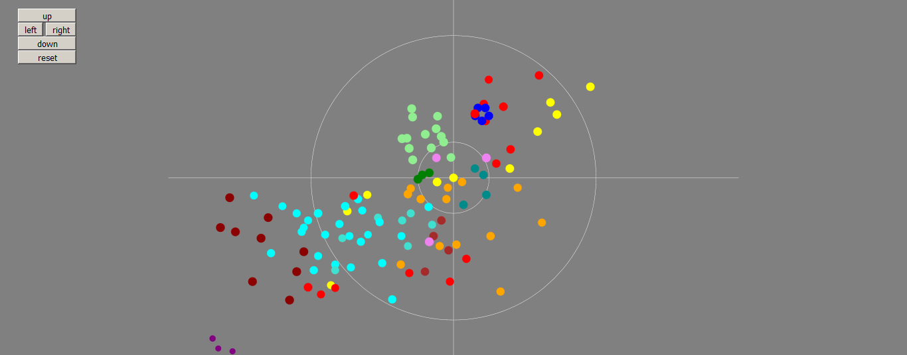

# tv_sphere_viewer

Ce projet est inspiré de l'univers du jeu de rôle "Tigres Volants" créé par Stéphane Gallay.

Mon objectif c'est d'avoir une carte interactive des mondes connus de la Sphère. Vous pouvez trouver la carte officielle [ici. (PDF)](https://www.tigres-volants.org/wp-content/uploads/2013/02/Sphere-px.pdf)

Et surtout je vous conseille de vous pencher sur le jeu, il le mérite vraiment et le dernier livre est libre ! (sous Creative Commons). [Retrouvez ça sur le site officiel.](https://www.tigres-volants.org)

## Serveur ou pas serveur ?

Le stockage des systèmes solaires allait forcément venir avec son lot de problèmes, les navigateurs forcent les utilisateurs d'AJAX à utiliser un serveur mais on peut contourner ce problème en collant le contenu du fichier JSON directement dans le code :

On va remplacer le bloc indiqué dans `main.js` par ceci :

```javascript
let stars = [{"name": "Fantir", "x": 0, "y": 0, "z": 0, "classes": "CPM "}, ...];
let sphere = new Universe(stars);
```

---

This project is inspired by the universe of Stéphane Gallay's tabletop roleplaying game "Tigres Volants".

My goal here is to have an interactive map of the known stellar systems called the Sphere. You can get a view of the official map [here(PDF).](https://www.tigres-volants.org/wp-content/uploads/2013/02/Sphere-px.pdf)

If you can read french and want to discover Tigres Volants, check [the official website.](https://www.tigres-volants.org) The last rulebook is entirely free under Creative Commons so don't hesitate.

## To use a server or not to use a server ?

Using AJAX eventually brought its problems, the users would need to set up a local server to run this app. But we can go around this problem by pasting the JSON's contents directly into the code. 

You'll need to replace the relevant piece of code in `main.js` with this :

```javascript
let stars = [{"name": "Fantir", "x": 0, "y": 0, "z": 0, "classes": "CPM "}, ...];
let sphere = new Universe(stars);
```
